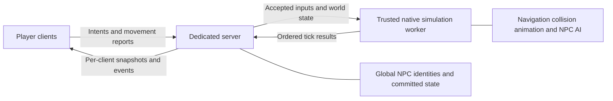

# Authoritative pedestrian multiplayer: research and requirements

Research date: 2026-09-26. Status: architecture recommendation and implementation requirements; no pedestrian runtime implementation or live multiplayer validation in this change.

## Recommendation

Start with **option 1: one trusted native game simulation worker per mission/world, operated by the server**, with the existing dedicated server retaining connections, entity identities, scripting, and the committed world state. Use the original runtime for pedestrian movement, animation, navigation, and collision. Replace its single-player population policy and camera-dependent gameplay decisions. Ordinary clients receive passive replicas.

First prove this with a normally initialized game process. Removing rendering is a separate milestone: model ticking, skeleton updates, collision, and simulation time must continue. A hidden window or skipped presentation does not establish a GPU-free headless server.

This is the most promising path for retaining Mafia behavior without first rebuilding much of its engine. It is conditional on proving unattended operation and the population budget on the intended host. If a native Linux executable with no Wine, window system, or graphics device is mandatory, choose option 2 and explicitly fund the larger runtime extraction. Do not claim option 1 already satisfies that constraint.

Do not use ordinary players as NPC simulation owners for the reliability target in this request. Do not start with local crowds and later switch to global authority at 30 players. Authority should be global from the first NPC; simulation coverage and replication coverage can expand independently.

The established pattern is a server-authoritative world with passive remote representations and per-connection relevance. This is documented by [Epic's networking overview](https://dev.epicgames.com/documentation/en-us/unreal-engine/networking-overview-for-unreal-engine), [Epic's relevance documentation](https://dev.epicgames.com/documentation/unreal-engine/actor-relevancy-in-unreal-engine), and [Unity's authoritative physics documentation](https://mp-docs.dl.it.unity3d.com/netcode/1.7.1/advanced-topics/physics/). These support the architecture, not a claim that a Mafia worker has already been proven in production.

## Evidence and limits

The primary evidence is the local reM working tree at `/home/david/Developer/reM`, especially:

| Evidence | Source locator in reM | Finding |
| --- | --- | --- |
| E1 | `projects/Game/src/core/C_game.cpp:925` | `SetActiveTrafficP` selects one generator around the active camera. It is an inline helper used by `Tick` and `Init`. |
| E2 | `projects/Game/src/actors/C_traffic_generator.cpp:1071` | Pool creation, density scaling, special pedestrian selection, and spawning. |
| E3 | `projects/Game/src/actors/C_traffic_generator.cpp:461` | A single camera supplies each element's distance before ticking; the same loop also schedules theft and taxi work. |
| E4 | `projects/Game/src/ai/C_traffic_element.cpp:986` | Render stamps, distance, fading, abandonment, animation and movement govern element lifetime. |
| E5 | `projects/Game/src/ai/C_traffic_element.cpp:2629` | Camera/speed-relative candidate placement, web nodes, clearance checks, randomized appearance and activation side effects. |
| E6 | `projects/Game/src/ai/C_traffic_element.cpp:2964` | Deactivation removes registrations and either returns a pool slot or deletes a free element. |
| E7 | `projects/Game/src/actors/C_don_ocas.cpp:86` | Shared collision proxy; off-camera vehicle collisions can delete pedestrians. |
| E8 | `projects/Game/src/ai/C_traffic_element.cpp:3012` | Damage contains a local-player-only vehicle ownership test. |
| E9 | `projects/Game/src/ai/C_traffic_element.cpp:3629`; `projects/Game/src/actors/C_traffic_generator.cpp:1370` | Gangster and police conversion into `C_entity`. |
| E10 | `projects/Game/src/actors/C_human.cpp:2488`; `projects/Game/src/ai/C_shvestky.cpp:1786` | Actor cleanup can reactivate an element; promoted actors have separate camera-dependent retirement. |
| E11 | `projects/Game/src/actors/C_traffic_generator.cpp:738`; `projects/Game/src/ai/C_traffic_element.cpp:1452` | Panic shares one global origin; movement and route selection read it later. |
| E12 | `projects/Game/src/actors/C_animations_machine_de_luxe.cpp:691` | Animation tracks write pedestrian world position/direction. |
| E13 | `projects/Game/src/core/C_mission.cpp:1276`; `projects/Game/src/ai/C_web_path.cpp:278`; `projects/Game/src/collision/g_collision.cpp:1625` | Mission, navigation and collision loading dependencies. |
| E14 | `projects/Game/src/actors/C_actor.cpp:836`; `projects/Game/src/actors/C_human.cpp:3965` | Actor visibility and human hit suppression depend on render stamps. |

[The accompanying inventory](pedestrian_multiplayer_inventory.json) records 75 function records, 36 source hashes, binary identity, tracker status, and entry bytes for the traffic generator, element, collision proxy, and the generator getter filed under a different tracker name. reM and this multiplayer checkout contain pre-existing local edits. A Git commit alone does not identify the examined source; use the recorded hashes too.

Tracker results are evidence of prior reconstruction work, not freshly performed verification. For example, the current tracker calls element `Tick` AUDITED with 39.12% binary similarity and `Activate` AUDITED with 56.11%. Those numbers are neither behavioral accuracy nor probabilities of correctness. `Deactivate`, `TickElements`, and generator `GameInit` are recorded BYTE_MATCHED. This research additionally inspected original-binary disassembly for generator `AI` entry and the complete `Deactivate` body. It did not re-audit every instruction, build reM, or run a multiplayer session. No live IDA session was available.

Addresses below identify the inspected retail binary. They are **not portable signatures or completed detours**. Exact inline patch sites, calling conventions, overwritten instructions, and all supported executable variants remain implementation verification work. The inventory is complete for the selected traffic classes' discovered tracker records, with explicit declarations/aliases noted below; it is not a claim of a complete engine-wide call graph.

## What the stock system actually does

### Population creation

1. Mission data loads generator configuration: model names, per-model counts, inner/outer placement radii, despawn radius, and maximum active count. `LoadData` handles two versions. One loaded legacy radius is unused at runtime.
2. `GameInit` allocates `C_traffic_element[]` from the sum of model instance counts and creates the models in shuffled slots. Pedestrian density scales the active count; increasing that count alone does not enlarge the pool. Special density controls which type 1/3 slots may activate.
3. `C_game::SetActiveTrafficP` clears generator activation flags and chooses one generator. Its `m_bEnabled` branches implement nearest selection versus a radius-based override; the flag must not be interpreted as a simple global on/off switch without preserving this behavior.
4. Generator `AI` either performs an initial batch or attempts regular generation after 113 ms. The initial activation flag is global, not per generator.
5. Element `Activate` chooses a location relative to the camera and local player speed, projects onto the pedestrian web, checks nearby elements and primary actors, then activates the model, collision, animation, interaction, and shadow registrations. It randomizes health, walk style, voice, and optional attachments. It is not a generic `SpawnAt(position)` API.

Constructor defaults are 50/90 world units for the generator's inner/outer radii and 100 for despawn; mission data can override them. Free elements created with `SetModel` default to 90 for despawn. The initial `Activate(true, ...)` branch samples from 5 units to the scaled outer radius instead of respecting the normal inner radius. These defaults must not become multiplayer safety assumptions.

### Simulation and deletion

Ordinary traffic elements are 0x200-byte objects, not `C_actor` subclasses. The generator is a 0xb8-byte actor. Traffic elements have their own global vector and a parallel animation-machine pool. `AddElement`/`DelElement` can move vector entries, so neither vector index nor native address is a durable network ID.

`TickElements` writes camera distance in the XZ plane. Element `Tick` consumes it for corpse removal, ejected-driver cleanup, fading and ordinary distance retirement. Render-stamp equality controls active-sector status and some model ticking. A free pedestrian unrendered for more than 10 seconds can be abandoned. Taxi handling has another distance exit. Invalid movement, falling/water behavior, and conversion introduce additional deactivation paths. These exits have different meanings.

`Deactivate` stops animation, turns off the model, unregisters shadow, global element, collision and interaction entries, clears other pedestrians' neck references, and releases attachments. For a generator-owned element it decrements the pool's active count. For a free element it destroys the model and deletes the element itself. **Never suppress all calls to `Deactivate`, and never dereference a free element after calling it.**

Population retirement, destruction of a client representation, death, transition to a full actor, and mission teardown must become separate multiplayer operations. Local stream-out is not world destruction.

### Interactions and full AI

`C_don_ocas` is the shared pedestrian collision actor. Frame ownership, dynamic collision ownership, and using-object ownership are not uniformly a unique pedestrian actor: generated model ownership points at the generator, while collision/interaction ownership routes through the proxy. Resolve the particular element from the model/collision frame.

The proxy's vehicle collision path checks visibility or distance from the camera; otherwise it deactivates the pedestrian. Element `Hit` subtracts vehicle-impact health only when the car's driver is the single local player. Both rules are wrong for a multiplayer authority.

Type 4 elements can become armed `C_entity` gangsters through `CreateMafianos`. Type 1/3 elements can become full police actors through `FizlosNamakatDoAkce`. The original element becomes generation-disabled and deactivates; the human stores a backreference. `C_human::GameDone` can release that reservation and call `ActivateFree`, which randomizes health again. This is a representation transition and potential resurrection path, not ordinary despawning.

Police already maintain per-person records (`C_shvestky::m_Persons`), so it would be inaccurate to describe the whole system as one wanted-level variable. Nevertheless, local-player exceptions, UI/game-failed paths, camera-based cleanup, shared action management, and spawned police vehicles remain. Multiplayer crime attribution and actor lifecycle need an explicit adapter.

`NewPanic(position)` sets one `g_vTrafficPanicPosition` and visits all active elements. `SetPanic`, `SetNewNode`, and alive movement read that shared origin. Two distant incidents can influence unrelated pedestrians. The scream cooldown is also global and output is filtered by the local camera and sound driver.

## Comparing the three proposals

| Proposal | Main advantage | Work that cannot be skipped | Assessment |
| --- | --- | --- | --- |
| Trusted native game worker | Reuses native maps, collision, animation and AI; one simulation across all players | Replace camera/player assumptions; provide all player/world proxies; headless proof; protocol; crash policy | Recommended first path, subject to feasibility gates |
| Portable native server simulation | Clean deployment and direct server ownership; eventual control over scaling | Asset/archive loaders, scene transforms, navigation, collision, skeleton/root motion, actor/AI/event runtime and parity testing | Strong long-term option, substantially larger initial scope |
| Player-simulated local traffic | No dedicated game runtime; distributes compute | Server-controlled spawn identity, exclusive leases, complete state transfer, overlap handling, disconnect recovery, trust validation | Poor fit for the requested reliability and faithful AI |

Option 2 does not require texture rendering, but it needs the data and runtime semantics used by gameplay. The observed dependency set includes `scene.i3d`, `scene2.bin`, `check.bin` navigation, applicable road data, collision data/frame bindings, model properties/hierarchy, poses, animation sets/TCK root motion, materials, dynamic collision and mission initialization. Full AI adds perception, hearing events, pathfinding, groups, action managers, weapons and police bookkeeping. Loading geometry and porting two traffic classes would leave this dependency set incomplete. A simpler custom pedestrian AI could reduce scope, but its behavior would differ from Mafia's.

An option-2 extraction should produce a versioned, content-hashed server map package with generator metadata, navigation and collision/frame transforms, plus pedestrian model bounds/properties and gameplay animation data. Preserve Y-up coordinates and units. Validate chunk versions, endianness, lengths/counts and link indices. `C_web_path::LoadNodes` reads the native node layout and then reconstructs link storage; a modern reader must not interpret stored pointer bytes as usable pointers. Node radius uses the low 16 bits scaled by 0.01, while node/connection flags have distinct navigation meanings. Compare sampled paths, ground rays, swept queries and root motion against native results before relying on the package.

If option 3 is ever required, the server must allocate all IDs and spawn locations first, assign exactly one simulator under a fenced lease, and freeze until a new owner acknowledges a complete state baseline. Never independently spawn on both clients and reconcile crowds by proximity. A transform, animation number and RNG seed do not transfer AI logs, root-motion progress, target references, police reservations or pending damage. The existing framework delegation helper is not sufficient evidence of a complete NPC transfer.

## Required architecture

### Authority and transaction contract

- AUTH-01: One worker lease per mission generation and virtual world. The dedicated server is the sole public writer of NPC replicas. Keep `ownerGUID` server-owned and leave ordinary-client delegation disabled.
- AUTH-02: Treat the worker as part of the server, using a separate authenticated control channel. It must not enter normal player admission, consume a player slot, or acquire arbitrary authority through ordinary client RPCs. Prefer same-host IPC initially.
- AUTH-03: The server issues entity identities and lifecycle commands. The worker alone advances native NPC simulation and computes native hit reactions. The server admits inputs and commits worker results in a monotonic tick/revision order. Do not independently subtract health on both sides.
- AUTH-04: Define one commit point for NPC damage, death, inventory, conversion, rewards and destruction. Inputs carry unique IDs; worker results carry the input IDs consumed. A repeated result cannot award money, spawn a pickup, or apply damage twice.
- AUTH-05: Native speculative effects stay inside the worker until their tick result commits. A worker resubmits an unacknowledged batch; the server deduplicates and acknowledges it. A stale worker epoch is rejected. Impossible or invalid results quarantine/restart the worker from a supported state; silently rejecting a result while letting its native world continue would create divergence.
- AUTH-06: Player and player-car state currently originate outside this worker. Supply timestamped accepted proxies for every relevant player, car, door, bridge, pickup and obstacle, with lifecycle generations. Do not simulate an imported vehicle a second time. A trusted NPC worker does not make existing client-controlled movement cheat-proof.
- AUTH-07: Process native calls on the game thread at defined tick boundaries. Networking threads enqueue typed data. Do not tick the same native world once per player or swap `m_pPlayer` around an entire game tick.
- AUTH-08: Worker and clients must agree on executable support, mission/content/mod manifest, coordinate system, model identifiers, protocol version and world generation before the world becomes ready.

### Identity and representation

Use a new server-owned `PedestrianEntity`, registered in shared code. Its conceptual key is `(missionGeneration, virtualWorld, networkId, lifeGeneration)`. Add `representationRevision` for element/full-human changes, `stateRevision`, and `workerEpoch`. Keep IDs within the framework's JavaScript-exact range when exposed to scripting; do not pack arbitrary 64-bit bitfields into JS numbers.

Maintain a separate worker binding for generator slot plus slot generation, element pointer, model/frame and full actor pointer. Preserve the same logical network ID through promotion/demotion. A newly allocated life after actual destruction receives a fresh identity/life generation. A client streaming back in receives the existing one.

The existing `NativeObjectRegistry` guards pointer reuse, but it supports one native object per network ID. Add a pedestrian binding structure supporting element, model, collision frame and optional human representations. Do not bind every pedestrian to `C_don_ocas` or overload the registry in a way that silently replaces the other aliases.

Lifecycle states must distinguish allocation, active simulation, dormancy, dying, corpse, pending representation transition, and destroyed. Client construction/loading/stream-out are separate local states. Death is absorbing for a life generation; native `ActivateFree` must not revive a corpse during demotion or cleanup.

### Population and observer coverage

- POP-01: Build observer sets per mission/world from accepted player positions and server-approved camera/spectator targets. Include both body and detached camera where gameplay needs both. Network interest and population interest must use compatible observer sets.
- POP-02: Compute the **union** of demanded navigation cells/regions. Choose a model distribution from the applicable generator policy for each region; do not multiply density by the number of nearby players. Preserve documented generator override semantics deliberately.
- POP-03: Use spatial spawn reservations and stable cell/generator identifiers to prevent duplicate candidates and overpopulation at overlapping generator boundaries. A reservation becomes a network entity only after native initialization succeeds; failed construction rolls back every registration.
- POP-04: Replace the one-camera generator selector and camera-relative placement with an explicit `SpawnAt` adapter. Retain native activation side effects, but make position, route, appearance, voice, health and attachments authority-selected. `ActivateFree` is a reference for registration, not a safe snapshot restore call.
- POP-05: Admit a new pedestrian outside every observer's protected region and visible area. Derive protection from possible sight distance, camera movement, network delay and loading delay. Camera frusta alone are insufficient because a player can turn. Where trustworthy visibility is unavailable, conservatively protect the full possible view region.
- POP-06: World retirement requires no protected observer, no relevant interaction, no pending combat/transition/pickup dependency, and expiry of an out-of-interest grace period. Recheck those conditions when committing deletion. One distant player never overrides another nearby player's retention.
- POP-07: Define independent activation, client stream-in, client stream-out and world retirement thresholds, with hysteresis and lookahead. Example starting values for measurement: client in 150, client out 180, simulation warm-up 220, world retirement 260 units plus 15 seconds. These are experimental, **not proven safe radii**; longer sight or interaction ranges must increase them.
- POP-08: Size the preload margin using at least `relativeSpeed * (inputAge + networkDelay + assetLoadTime + schedulingDelay) + safetyMargin`. Teleports and camera jumps require a readiness/baseline barrier rather than relying on that finite-speed formula.
- POP-09: Re-entry during retirement cancels retirement before it commits. Re-entry after committed destruction receives the new population normally; stale packets cannot restore the old life. For a live identity that merely streamed out, recreate its current state without rerandomizing it.
- POP-10: Use world and regional active-count budgets, corpse budgets, and model-pool capacities. Resize pools only at safe ownership boundaries or allocate stable additional blocks; moving arrays invalidates actor backreferences. Use finite budgets even with map-wide coverage.
- POP-11: When the union covers the whole map, continue the same authority model. If all desired pedestrians cannot meet the tick budget, reduce admission/density explicitly. Do not evict visible pedestrians or create an unannounced second simulation authority to recover performance.
- POP-12: No-spawn zones and no-retirement/persistence zones are separate server features. They do not follow automatically from a larger generator radius. Define behavior for unloaded interiors, disconnected navigation islands, teleports, pursuit, corpse retention, and zero connected players.
- POP-13: Prepopulate required coverage before releasing the initial world-readiness barrier. If all safe candidates are occupied or visible during play, defer admission; meeting a density target does not permit visible spawning. An empty/damaged region can recover gradually when candidates become safe.

Recommended initial persistence policy: full-rate relevant pedestrians, retained corpses/interactions, grace-period retention outside coverage, then explicit retirement of ordinary ambient pedestrians. Continuous life simulation everywhere while nobody can observe it is a separate product requirement and budget.

### Replication and remote presentation

| Data | Delivery and required meaning |
| --- | --- |
| Construction baseline | Reliable: identity/life/representation revisions, model and content ID, scale/style/voice/attachments, transform at authoritative tick, health/lifecycle, active animation with phase/start time, target/interaction references and current persistent effects |
| Movement snapshots | Unreliable, newest useful state wins: tick, life and representation fences, position/orientation/velocity, locomotion and animation progress needed for interpolation |
| Durable state | Reliable ordered revisions: health, death/corpse, representation, equipment, target, seat/dependency and interaction state; included in later baselines |
| Transient events | Sequenced IDs and expiry: sound, gesture, hit reaction, gunshot, impact or attachment drop. Replaying a baseline must not replay old rewards or expired sounds |
| Destruction | Reliable lifecycle tombstone with identity and revision; separate from per-client stream-out |

NET-01: Passive replicas must not run generator AI, element `RunAliveAI`, full-actor decision logic, random route selection, panic decisions, authoritative damage or native lifetime decisions. They may animate and maintain query collision needed for local aiming. They must not publish independently computed NPC physics outcomes.

NET-02: Do not call native `Activate` on receiving a spawn; it selects its own location and random state. Build a passive model/element through a typed adapter and apply the received baseline atomically. Do not assume all human animation state fits the current player's locomotion field.

NET-03: Animation tracks can change world position. Remote root motion must not compete with network transforms. Advance the visual pose at the interpolated server time while the snapshot owns world placement; isolate or cancel native world-motion writes and callbacks that change gameplay. Worker animation/root motion remains authoritative.

NET-04: Use bounded interpolation/extrapolation. An initial test configuration can use 20 Hz snapshots and a 100–150 ms interpolation buffer, but tune from measurement. After a bounded outage, freeze or visibly enter recovery; do not extrapolate indefinitely. Network latency precludes identical wall-clock views on all clients.

NET-05: Reliable fields and unreliable transforms can arrive in different orders. Reject or briefly buffer movement/events for a future representation revision until its baseline exists, discard obsolete revisions, and never let an old walking packet revive a dead NPC. Baselines must work without historic RPC delivery.

NET-06: Model loading is asynchronous relative to replication. Buffer only the newest compatible state and a bounded set of unexpired events. Report content failure; do not silently show an invisible collidable authority object indefinitely. Gate initial client readiness on required assets.

NET-07: Client collision proxies follow the presentation pose for aiming; authoritative queries use worker/history state. Use an explicit NPC interaction/collision policy for player movement: either authoritative contact correction or nonblocking ambient pedestrians. Keeping each player's native blocking response without reconciliation cannot promise identical physical outcomes.

NET-08: Existing interest-grid support includes lookahead, stream-out margin, per-type budgets and sticky ranking. Reuse it, but pin active interactions/visible critical entities and their dependencies. A nearest-N budget can still make two nearby viewers see different gameplay-relevant crowds. Control global population so critical entities fit; never silently remove an attacking or colliding NPC from one observer.

NET-09: Do not use `alwaysVisible` on every NPC to approximate global simulation. Global identity and simulation do not require sending every NPC to every connection.

### Combat, reaction and audio

COM-01: Generalize combat target resolution beyond `PlayerService::FindByNetworkId`. Use an explicit player/pedestrian combat target contract. Validate mission/life, sender, accepted weapon action, rate/ammunition, pellet, target history, distance and line of sight. Reuse existing shot/event deduplication patterns.

COM-02: Choose the worker's native collision result as the NPC hit authority. Client hits are evidence/intents. Replayed client bullets, proxy collisions, explosions and flames must not call damage locally and then receive that damage again from the server.

COM-03: For firearms, retain bounded historical NPC poses/hit shapes and a validated timestamp mapping. The current code's client-derived shot trajectories and lack of server mission geometry are not full authoritative hit validation. Integrating trusted worker geometry is real new work. Moving doors/cars and animation phase require a defined history/rewind policy; positions alone cannot reproduce skeletal hits.

COM-04: For player-car impacts, import validated car trajectories and use continuous/swept tests to prevent tunnelling between reports. Apply health and reaction once, attribute the driver by network identity, and replace the native local-player-only eligibility rule. Player cars still exist when ambient traffic cars are disabled.

COM-05: Replace global panic origin with per-pedestrian threat/event state. Patch all reads in `SetPanic`, `SetNewNode` and `Tick`'s alive path. Select a relevant threat deterministically from accepted incidents and apply a bounded spatial influence. Do not mutate one global origin once and expect later ticks to retain the right incident.

COM-06: Route screams and gestures as selected event IDs, locations and start ticks. Apply audibility on each receiving client. The worker's sound driver/camera must not decide whether distant players receive the event. Preserve logical AI hearing events even if physical sound output is disabled. Separate cosmetic voice throttling from NPC behavior.

COM-07: Death commits one corpse state and at most one loot/reward transition. Persist the corpse baseline for late join/stream-in and retain it for nearby observers. Cosmetic dropped umbrellas may be local only if they have no collision, pickup or gameplay effect; otherwise use authoritative entities.

COM-08: Full NPC attacks require the reverse path too: worker-selected aim, weapon, ammunition, fire/melee event and target outcome must enter the same server combat ledger, including damage to players. Never impersonate a player controller GUID to reuse player-only admission. Import every participating player's collision/perception proxy into the worker even when far from its initialization camera, and remove stale target references on disconnect/death.

## Native hook and patch requirements

These are required behavioral dispositions, not an instruction to detour every leaf method. Hook the smallest proven boundary that enforces the contract. Preserve original allocation, reference-count and teardown semantics where applicable. Every implementation entry needs a contract recording supported image/hash, resolved address/signature, ABI/stack behavior, pointer lifetime, caller coverage, original-call policy, and removal order.

For nonstatic member functions, reM declarations generally indicate x86 `__thiscall`; static methods explicitly declare `__fastcall` or `__cdecl`. Validate the binary rather than infer from the name. In particular, the first two fastcall arguments occupy ECX/EDX and remaining arguments use the stack; detour wrappers must respect this. The byte samples in the inventory include absolute operands and are not relocation-safe patterns.

### Generator surface

Addresses are hexadecimal. W = trusted worker; C = ordinary client.

| Function | Address | Required treatment |
| --- | --- | --- |
| Constructor / destructor / `DuplicateFrom` | `44d410`, `44d4a0`, `44d510` | Preserve native allocation/configuration; capture stable generator identity separately. No raw native pointer replication. |
| `LoadData` | `44d820` | Capture both configuration versions, model sets/counts and region policy. Validate external counts before custom allocation. |
| `GameInit` | `44e500` | Install role policy before initial generation can occur; size pools safely; capture model metadata. Server config controls density, not the user's graphical settings. |
| `GameDone` | `44e7eb` | Invalidate element/frame bindings before native destruction; preserve pool/animation cleanup and mission shutdown. |
| `AI` | `44edb0` | W: replace local spawning with population scheduler. C: suppress autonomous generation. Prevent duplicate native and custom spawning. |
| `SetVisible` | `44e960` | Separate simulation enablement from local drawing. Do not turn all replicas off through a global traffic flag. |
| `TickElements` | `44ef70` | W: one simulation pass, multi-observer retention inputs, no local camera authority. C: passive presentation pass only. Disable taxi/theft scheduling in v1. |
| `AddElement` / `DelElement` | `44ebe0`, `44ed00` | Maintain element/animation pairing; bind/invalidate per-life handles. Reindexing must not change IDs. |
| `ClearElements` / `FreeDynCollElements` | `44fd50`, `450860` | Preserve authorized bulk teardown; scope world reset separately from ambient retirement. Never suppress shutdown cleanup. |
| `GetElemFromFrame` | `450830` | Resolve correct model identity at collision/use boundaries. Existing lookup compares root model pointers; normalize child frames only where the caller contract requires it. |
| `GetNearElementDist2` / `IsNearElementBefore` / `IsPossibleCollElem` | `4508a0`, `450920`, `44e9c0` | W uses one shared population. Profile linear scans; replace with equivalent spatial queries if required. C does not run avoidance decisions. |
| `AddFreePerson` / `AddFreePersonFromCar` | `450f00`, `450f80` | Intercept non-generator entry paths; adopt exactly one logical entity or reject an unsupported source. Audit failure ownership; never leak a newly allocated element on a failed activation. |
| `Fire` / `Explosion` | `450780`, `450450` | W executes accepted incident once; C suppresses damage side effects. Preserve distinct radius vs squared-radius argument semantics. Names alone do not establish native hit-type semantics. |
| `NewPanic(position)` / `NewPanic(frame)` | `4509d0`, `450a30` | Authority-selected spatial incident with per-element origin; frame form requires the same identity mapping. |
| `PlayerHoMaVytaseneho` | `44e890` | Replace one-player neck/weapon reaction with relevant network actor selection; references must expire on target destruction. |
| `FizlosNamakatDoAkce` | `44fde0` | Disabled for civilian v1. Later wrap promotion as a single identity-preserving transaction with explicit offender/target. |
| `TryGoToAssHole` / `IsCarHasOcas` / `VyfunOdTeMasiny` | `44f0e0`, `44f090`, `4512a0` | Disable ambient theft/adoption in v1; preserve necessary reference cleanup when a player car is destroyed. |
| `EnableTaxiDriver` / `PlayerInTaxi` / `GeneratePassengerForTaxi` / `ZrusVsechnyMavajici` | `44fcf0`, `44f740`, `44f7d0`, `44fd10` | Taxi generation/conversion disabled in v1; retain safe animation cancellation for any existing state. |
| `RailwayInStation` | `450a60` | Disable passenger transfer in v1; otherwise this duplicates a model, changes representation and deactivates the element. |
| `ElementNewScream` / `SetScreamsEnabled` | `4510b0`, `47b780` | W emits logical sound event before native camera/audio filtering. C plays accepted sound once; per-client volume is local. |
| `SaveGameGetSize` / `SaveGameSave` | `44de00`, `44de20` | Preserve retail contract where used. Do not use its partial element records as a wire protocol or claim complete worker failover. |
| `GetElements` | `4b8540`, implemented in `C_game.cpp` | Returns traffic-car elements without drivers, not the pedestrian vector. Do not use it as the pedestrian registry. |
| `DetachMesh` | declaration; empty folded callback noted in source | Resolve actual alias/caller ABI before use. No broad detour of the shared empty body. |

The inventory also retains CRT vector initialization/destruction records. They are not standalone population-policy patch points.

### Element and collision proxy surface

| Function | Address | Required treatment |
| --- | --- | --- |
| Element constructor | `4513a0` | Preserve native shape; initialize multiplayer sidecar state separately. Empty destructor shares a folded body; do not globally hook it. |
| `CreateModel` / `SetModel` | `456a40`, `456630` | Preserve distinct model acquisition/ownership contracts; capture properties, attach identity mappings and collision/use bindings. |
| `DestroyModel` | `456ec0` | Invalidate aliases and callbacks first. Generated models go to mission frame cache; free models are released. Preserve ownership rules. |
| `Activate` | `4577f0` | Replace placement policy with explicit approved spawn construction. Preserve successful activation registration; do not run separately on every client. |
| `ActivateFree` | `456fa0` | Controlled adoption/demotion only. Prevent health randomization, life reset or double registration during restore. |
| `Deactivate` | `4587c0` | Central lifecycle observation and authorized teardown. All rejectable retirement decisions must be patched before mutation; do not blanket veto this method. It can delete `this`. |
| `Tick` | `452cd0` | Replace camera/range/render-dependent gameplay branches; W keeps physics/animation; C has separate passive update. Internal helpers are inlined and are not independent retail hook addresses. |
| `SetNewNode` / `ObejdiTuPicovinu` | `451860`, `451400` | Authority-only routing/avoidance; per-NPC panic source; gate car adoption and police recruiting branches in v1. |
| `UpdateModel` | `4564f0` | Synchronize model, sector, inverse transform and dynamic collision. A bare frame position write is insufficient. |
| `SetAlpha` | `456ea0` | Presentation fade only; local alpha must not independently destroy an authoritative identity. |
| `SetAnim` | `459450` | W chooses state. C uses received clip/phase; audit collision reinsertion and world-motion side effects. |
| `Hit` | `4588d0` | One authoritative application; replace local-driver eligibility; record reaction/death state and attacker identity. |
| `SetPanic` / `SetMegaPanic` | `459650`, `4597b0` | W only; per-NPC threat origin, explicit random selection and authoritative resulting state. |
| `CreateMafianos` | `459b90` | Disabled for civilian v1. Later transactional promotion under existing ID, preserving hit event exactly once. |
| `MavaNaTaxi` / `EndMavaniNaTaxi` | `451ff0`, `452ca0` | Gate taxi decisions/actor creation and its distance retirement; animation cleanup remains safe. |
| `PlayerNaMneMluvi` / `Karle_hoj` / scream frame callback | `4598d0`, `459850`, `44e870` | Network interaction target and sequenced gesture/voice; suppress duplicated local decisions. |
| `DropUmbrella` | `459a50` | Choose cosmetic noninteractive replica or authoritative physics entity; no uncontrolled local gameplay prop. |
| Proxy constructor / deleting destructor / destructor / `GameInit` | `44c640`, `44c660`, `44c680`, `44c690` | Preserve shared proxy lifetime; never use its pointer as a unique pedestrian ID. |
| `C_don_ocas::Collision` | `44ca50` | Remove camera-dependent deletion; route correct car/person impact to the one NPC authority. |
| `C_don_ocas::Hit` | `44ccf0` | Preserve skeleton query/body-part semantics; map model to NPC; C reports evidence without authoritative mutation. |
| `C_don_ocas::IsPossibleColl` / `GetBoundPoints2D` | `44c6a0`, `44d1c0` | Query the correct representation and collision policy; preserve geometry semantics, including passive query shapes. |

### Required integration beyond those classes

| Surface | Evidence/address | Required change or audit |
| --- | --- | --- |
| Generator selection in `C_game` | `Tick 5a51c0`, `Init 5a0810`; inline `SetActiveTrafficP` | Replace all inlined single-observer selection sites. A detour to a source helper that has no retail function will not work. Prefer a proven call-site patch or scheduler integration that prevents the original selector from overwriting it. |
| Coupled traffic switch | `C_game::SetTrafficVisible 5a8470` | Split pedestrian, ambient-car and police policy. The current call also invokes car `Scipni` and police freeze. |
| Ambient car suppression | `C_traffic_car::Scipni 4aaa00`, `AI 4afc40`, `GameInit 4b54a0` | Retain disabled ambient cars in v1. Audit independent car creation paths; preserve player-controlled cars. |
| Rail suppression | `C_rail_generator::AI 597bf0`; existing world hooks | Retain generator and placed-rail suppression; do not assume the traffic visibility flag covers rail. |
| Main loop/headless | `C_mission::Tick 5407e0`, `C_game::Tick`, `WinMain.cpp` | Keep scene/driver/model/simulation tick order. Remove UI/input/presentation only after auditing dependencies. Advance logical clocks independently of rendering. |
| Actor visibility/network mode | `C_actor::Tick 4064f0` | W visibility semantics must reflect simulation needs. `SetNetworkControlled` switches AI to `NetDirect` but still calls `Update`; it is not sufficient by itself for passive full humans. |
| Full-human damage | `C_human::Hit 5762a0` | Replace render-stamp debounce dependence with an explicit simulation-event/tick policy where needed; authoritative event deduplication must permit legitimate distinct hits. |
| Full AI | `C_entity::AI 508150`, `ForceAI 523d30`, `Update 51b2f0` | W runs decisions/perception; C suppresses AI and mutating update paths while retaining presentation. Enumerate downstream writes before enabling special NPCs. |
| Animation machine | `Tick 40f1b0`, `SetAnim 40e950`, pedestrian `Init 40e6d0` | Separate pose evaluation from authoritative root placement and event callbacks. Preserve skeleton updates without rendering. |
| Promotion lifecycle | `AddTemporaryActor 5a77c0`, `RemoveTemporaryActor 5a79a0`, `_RemoveTemporaryActor 5a7ec0` | Bind representation before publication; guard pending-removal ordering; invalidate before release. |
| Demotion/resurrection | `C_human::GameDone 5757c0`, `Deactivate 58b330`, `C_entity::GameDone 507d30` | Distinguish accepted demotion from death and mission close. Block unintended `ActivateFree` reactivation and native-slot reuse. |
| Police recycling | `C_shvestky::TickDoRiciActors 49ea80`, `FreeTempEnemy 49e690`, `FreeMyTempActor 49e7e0`, `Tick 49a300` | Replace camera cleanup; preserve shared reservations and per-person crimes; disable police vehicle/reinforcement paths until supported. |
| Police/global AI services | `C_shvestky`, `ai_police_nastenka`, sensors/logs/groups | Map all network players, remove local-only UI/failure actions, and route perception/events with explicit world and target identity. Further per-method audit is a gate for police support. |
| Mission teardown | `C_mission::Close 5405e0`, `C_game::Done 5a3c60`, `DoneIntern 5a4d20` | Cancel queued work, fence generations and clear references while native objects are valid; then retain stock shutdown order. |
| Combat/impact/use producers | `C_game` shots, native human attacks, vehicle collision, fire/explosion and use paths | Audit all producers into the listed consumer hooks, including replay guards; do not assume bullets are the only damage source. |

A deactivation request must carry a semantic reason: ambient retirement, local stream-out, representation transfer, unrecoverable simulation error, explicit script removal, or mission shutdown. Patch mutation sites to supply that reason. Return-address guessing or silently overriding `Deactivate` after half a conversion has occurred is not a robust policy.

## Changes required in this multiplayer repository

| Existing location | Required integration |
| --- | --- |
| `code/client/src/features/world/world_service.cpp:163` | Replace blanket post-init `SetTrafficVisible(false)` with role-specific policy. Install spawn suppression before native initialization can populate the world; allow only approved replicas/worker population. |
| `code/client/src/features/world/world_hooks.cpp` | Preserve mission and rail policies; introduce worker lifecycle integration without inheriting normal client menu/UI assumptions. |
| `code/shared/register_entities.cpp` | Register `PedestrianEntity` identically on server/client. |
| `code/shared/features/player/player_entity.h` | Reuse the server-owned replica principle, not the entire player type. NPCs do not need player session/controller semantics. |
| New `code/shared/features/pedestrian/` | Entity/baseline/snapshot, lifecycle and reaction protocol, identity fences, and typed worker messages. |
| New `code/server/src/features/pedestrian/` | Population/interest policy, worker supervision, lifecycle ledger, input admission, scripting and commit logic. |
| New `code/client/src/features/pedestrian/` | Passive native bindings, model load/baseline handling, interpolation, animation, impact/use reporting and teardown. |
| New worker adapter/entry target, placement decided during feasibility work | Dedicated role with game-thread native adapters and IPC. Keep server-only concerns out of regular player startup. |
| `code/client/src/game/entities/native_object_registry.*` | Keep existing lifetime protections; add explicit pedestrian representation aliases rather than assume one actor pointer per NPC. |
| `code/server/src/features/combat/combat_service.cpp:838` and client combat/death/car services | Generalize player-only targets, effects and death handling; integrate one authoritative NPC hit path and current car impact policy. |
| Framework `networking/replication/interest_grid.*` | Reuse existing margins/lookahead/budgets; add only the missing interaction retention and observer handling. No NPC ownership election. |
| `code/sdk/include/mafia1/sdk/` | Typed borrowed views for traffic generator/element/proxy and necessary animation calls, with proven sizes/offsets and ABI contracts. |
| `docs/native_contract.md` | Record verified hook bytes/ABI/lifetime/removal order when implemented; this research does not replace that contract. |

Do not mix `PedestrianEntity` ownership with the framework's current `stateEpoch` implementation. Its small internal fence is not a durable worker-instance identifier. Use a separately specified wide worker epoch and lifecycle revisions. Coordinate the wire/schema change and required client/server version bump.

## Scope for the first playable version

Enable civilian walking, idle, avoidance, proximity/use reactions, per-incident panic, validated hit reactions, death/corpses and consistent stream-in/out. Disable ambient cars, rail passengers, taxi customers, theft, full police and gangster promotion. Filter special archetypes from the admitted population instead of leaving dangerous conversion branches reachable. Keep player-owned cars functional and include their pedestrian avoidance/impact handling in the acceptance scope, or explicitly disable those interactions for the prototype only.

The schema must already support representation changes and actor references. Police and gangsters are the next milestone, not unsupported local actors slipped into v1. Implement promotion by reserving the old slot, constructing/initializing the full actor, atomically committing its representation revision, and releasing the old visual/collision representation. On failure retain or restore the prior coherent state; never publish half the transition. Demotion preserves life/health and cannot resurrect a dead actor. Only the worker runs full AI.

For police, add explicit offender records, shared witness/crime events, pursuit targets, lost-target behavior, arrest/fine/death rules and cleanup. Existing per-person native records can help, but UI/game-over behavior must become server game rules. Police vehicles remain disabled until the vehicle phase. Future NPC car entry requires a single seat reservation transaction and an explicit car simulation authority policy; a car is never re-created merely because its nearest player changes.

## Headless operation and failure policy

HEAD-01: Establish unattended boot, asset mounting, mission load/readiness, network/control channel, continuous ticking, orderly shutdown and repeated mission reload first. A dummy local player/camera may be retained for required native initialization, but it must be excluded from population observers, AI targets, combat, statistics and replication.

HEAD-02: Audit render-stamp reads in pedestrian ticks, actor visibility, hit debounce, perception and animation. Separate visual visibility from simulation relevance. Merely holding all stamps equal or incrementing the scene stamp can respectively make everything visible or everything invisible; neither establishes correct headless behavior.

HEAD-03: Keep skeletal pose and TCK evaluation, collision transform updates and logical hearing. Disable particle/audio rendering through defined interfaces while preserving gameplay events. Prove operation with presentation removed, then with the target graphics backend unavailable if GPU-free deployment is a requirement.

HEAD-04: Choose and validate a simulation timestep rather than blindly impose one. An initial 30 Hz experiment must be compared with stock behavior; frame-counted activation/collision delays and wall-clock hit logic need attention. Bound catch-up after pauses; do not apply one giant delta to physics. This is snapshot replication, not cross-machine deterministic lockstep.

FAIL-01: A lease expiry fences the worker before accepting a replacement. Pause new NPC interactions, retain committed state, stop unbounded extrapolation and expose worker health. Never silently hand simulation to a nearby player.

FAIL-02: The native save record is not demonstrated to serialize complete AI/animation/pointer graphs. Initial worker-crash policy should be controlled NPC/world resynchronization with a new worker epoch and explicit client readiness. Preserve already committed gameplay effects and never duplicate them after restart. Do not promise seamless pursuit/animation continuation.

FAIL-03: If uninterrupted persistent NPC continuity is mandatory, implement and verify a full versioned semantic checkpoint: entity references, routes, animation progress/root-motion state, AI logs/actions/groups, police state, RNG streams, timers, inventory, pending incidents and slot reservations. A fresh process must restore it; saving raw memory addresses is not portable. Deterministic replay/hot standby is a separate proof obligation.

FAIL-04: Define failures separately: worker exit, worker hang, IPC partition, dedicated-server crash, client reconnect and mission change. Host/server crash persistence requires durable commits/checkpoints; in-memory worker deduplication alone does not survive it. State the recovery point and time objectives before advertising persistence.

## Performance and release evidence

Player count is not an NPC budget. Thirty clustered players and thirty evenly distributed players stress different paths; both can later converge into one crowd. Measure NPC count, model/skeleton memory, root-motion/AI/collision cost, broadphase cost and per-viewer replication work.

Stock pedestrian avoidance scans the global vector, and each pedestrian also scans actor collections in several paths. A naive full-map expansion can approach quadratic pedestrian work. Use spatial indexing for local queries where profiling justifies it, preserving selection/tie semantics where they matter. Budget promoted combat AI separately from ambient walkers. The 32-bit native worker's address-space pressure must be measured.

Illustrative payload estimate, not a benchmark: 30 viewers × 80 relevant NPCs × 48 snapshot bytes × 20 Hz = 2,304,000 bytes/s, about 18.4 Mbit/s of outbound payload before packet headers, construction, reliable events and retransmission. Measure actual serialized size and traffic. Each client would receive about 76.8 kB/s of this illustrative movement payload. Global simulation does not justify globally broadcasting that population.

Agree numeric targets on named hardware after the feasibility run. Suggested starting release contract: sustained 30 Hz worker with p99 simulation work below 25 ms under the agreed population; no unbounded queues or memory growth; a 24-hour soak; and authoritative state convergence after loss within the tested recovery window. These are proposed targets, not achieved results.

| Test | Required assertion |
| --- | --- |
| Two distant players converge, cross and separate repeatedly | Same NPC IDs/lives in overlapping interest; no double spawn, merge teleport, crowd replacement or duplicate authority |
| A leaves while B remains at the original despawn boundary | NPC remains alive/visible to B; all native retirement paths obey shared retention |
| Thirty observers distributed, clustered, then converging | Regional density is not multiplied by viewers; all critical entities remain representable within measured budgets |
| Camera turns, free camera/spectator, indoor/outdoor, bridge/vertical separation | No creation/removal in protected visibility; correct approved observer coverage and world separation |
| Stationary far-away worker camera; rendering on/off | Identical admitted population/lifetime rules; off-camera impacts and AI still work |
| Simultaneous distant gunshots/explosions | Each NPC reacts to its relevant incident; no global panic-source overwrite |
| Two players hit the same NPC; shotgun pellets, replay and duplicate reports | Each accepted hit applies once; one death, loot and reward; deterministic ordering of contested events |
| Player-car impact at speed, hit while turning/streaming | No off-camera deletion, tunnelling or driver-local-only damage; one committed result |
| Join/stream-in during panic, death, corpse and promotion | Correct current pose/life/representation without old RPC replay or random reset |
| Promotion/demotion with simultaneous death/disconnect/mission close | One network identity and one active collision representation; no corpse resurrection, stale pointer or reused-slot alias |
| 0/80/200/400 ms RTT; jitter; 1/5/10% loss; reordering; 2-second outage | Ordered durable state, stale-packet rejection, bounded presentation error and recovery; define playable vs recovery envelopes separately |
| Different client render rates; worker stalls and catch-up | NPC gameplay independent of client FPS; bounded physics timestep and no repeated damage |
| Pool exhaustion, missing model, malformed/failed load | Coherent rollback, no invisible colliders, leaks or corrupt active counts |
| Worker killed/hung/partitioned at a commit boundary | Old epoch rejected; explicit recovery; no duplicated rewards or competing simulator |
| Repeated mission load/unload, disconnect and long soak | No live native references across generations, no monotonic pool/collision/animation growth |

Record tick/revision-tagged snapshots and lifecycle logs at all peers. Compare at the **same authoritative simulation tick**, not at simultaneous wall-clock render frames. Visual-error tolerances must be defined in advance for walking, panic, impacts and recovery. Live tests need at least two real clients; simulated observers alone cannot validate native rendering/collision behavior.

## Delivery sequence and decisions

1. **Feasibility gate:** instrument native lifecycle/camera dependencies, build a trusted worker prototype with rendering initially enabled, load the full requested map, import two separated observer/player proxies, and prove one shared civilian population. Benchmark distributed and converged loads. Stop and revisit option 2 if unattended operation or capacity fails.
2. **Native policy gate:** implement multi-observer spawn/retention, explicit lifecycle reasons, per-NPC panic, player-car impacts, and safe pool/teardown behavior. Verify no stock side path creates an untracked NPC.
3. **Replication gate:** implement `PedestrianEntity`, passive adapters, complete baselines, animation/root-motion handling, interest retention, damage/reaction integration and late-join/loss tests.
4. **Operational gate:** remove presentation in stages, test deployment/runtime constraints, fence worker failures and establish recovery/soak evidence. Ship civilian support only after these gates pass.
5. **Full-AI gate:** promotion/demotion, gangs and police, offender-specific rules, death/pickup integration and separate population limits. Repeat combat/failure tests with full actors.
6. **Vehicle phase:** one global vehicle registry, NPC seats/driver ownership, theft/taxis and rail as separately scoped work. Reuse identities and event contracts from pedestrian support.

Critical product decisions, with recommended defaults:

| Decision | Recommended default | Consequence of a different answer |
| --- | --- | --- |
| Can hosting include a trusted native game process and game assets, with Windows/Wine initially? | Yes, subject to measured unattended operation | Strict native Linux/GPU-free requirements favor option 2 unless the worker proves those constraints |
| Must pedestrians live continuously everywhere with zero nearby players? | Retire ordinary ambient population outside protected coverage; persist meaningful interactions/corpses as configured | Continuous global life requires a larger simulation/checkpoint budget |
| Are police and armed gangsters required in the first playable release? | Civilian reactions and damage first; full AI next | Full AI substantially expands perception, combat, promotion and cleanup scope |
| What population must work on which host/client hardware? | Set explicit per-region/global counts and a separate promoted-AI budget after profiling | “30 players” alone cannot size CPU, memory, bandwidth or visibility budgets |
| Is controlled resynchronization acceptable after worker failure? | Yes for initial release; retain committed game outcomes | Seamless continuity requires complete checkpoint/replay/failover work before release |
| Must NPCs physically block players and receive player-car hits in v1? | Keep player-car hits; choose an explicit reconciled player-contact policy | Exact bidirectional physical contact may require expanding existing player/vehicle authority and correction |

No architecture can guarantee zero latency, zero visual correction or freedom from every failure. The deliverable is one authoritative outcome, stable identity, no camera-triggered removal near another player, bounded presentation error, and an explicit recovery contract verified against the release matrix. This document specifies that work; it does not label the unbuilt integration battle-proven.
